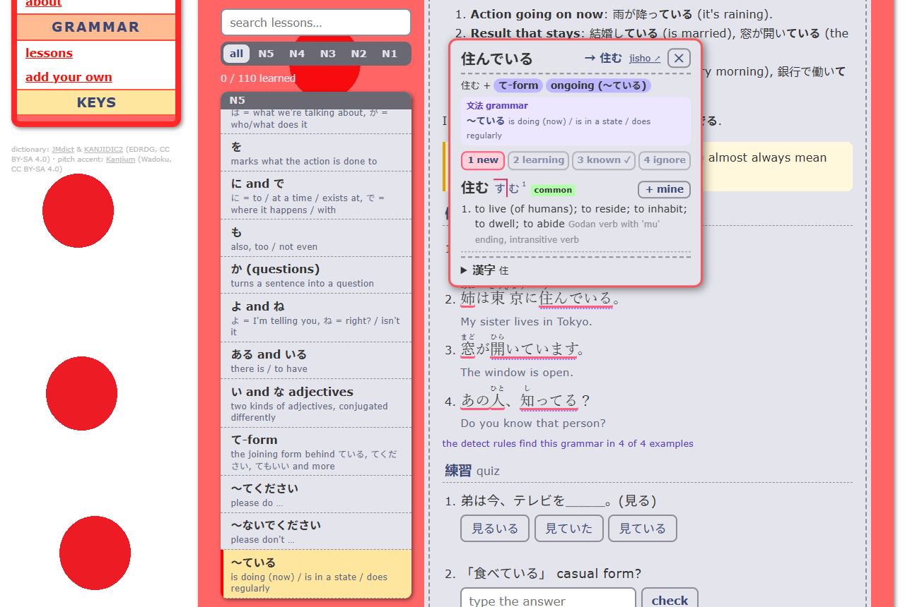

# Akko

An immersion app for learning **Japanese** or **American English**, on your own computer. Free and open source.



- **Watch** videos with subtitles. Search Japanese subtitles (kitsunekko, JP-Subtitles) or English ones (OpenSubtitles), load your own, or use the ones **inside the video file** (.mkv), no website needed.
- **Read** books (EPUB, text) and manga.
- **Listen** to podcasts with transcripts.
- **Click any word** to see its dictionary entry, kanji and pitch accent, plus any **dictionaries you add** (Yomitan format: Jitendex, monolingual dictionaries…) and how common the word is (frequency lists like JPDB). Hover a word and press 1–4 to mark it new / learning / known / ignored; the app colours words by how well you know them.
- Send words to **Anki** as flashcards.
- Follow the **course**: a step-by-step path from the basics to immersion, built on the AJATT idea, with goals the app checks for you. The Japanese course and the N5 grammar lessons are also in **Portuguese and Spanish** (Settings → Your language).
- Study **grammar** with short lessons and quizzes (Japanese N5–N1, English A1–C1). Grammar you've studied is underlined in subtitles and texts.
- A **welcome screen** each time you open akko: pick today's language, see today's minutes and your streak.
- **Settings**: the language you learn, the interface language (English / 日本語), display options, stats and backup.

You choose Japanese or English on the first visit, and can switch in Settings. Each language keeps its own words and progress. Lessons and the course are Markdown files you can edit or add to (see [grammar/README.md](grammar/README.md) and [course/README.md](course/README.md)).

The dictionaries work offline.

### English mode

- Definitions ([WordNet](https://wordnet.princeton.edu/)) and American pronunciation ([CMU Pronouncing Dictionary](https://github.com/cmusphinx/cmudict)) work offline.
- Translations into your own language (about 20 to choose from in Settings, from Wiktionary) and American recordings (Wikimedia Commons) need the internet the first time you look up a word; then they're saved.
- English subtitles can be searched on OpenSubtitles.com with your free API key (Settings → English subtitles).
- The English grammar lessons (`grammar-en/`) and course (`course-en/`) are also translated into Portuguese, Spanish and Japanese.

## Two ways to run it

You can use akko either way; it's the same app.

- **Desktop app** (easiest): download the installer (`akko-setup-<version>.exe`) or the version without install (`akko-portable-<version>.exe`) from the [Releases page](https://github.com/JaoN64dev/japaneselocalwebapp/releases) and open it. Nothing else to install: the dictionaries come inside.
  - **App window or your browser?** Each time akko starts, it asks how to open: in its own **app window**, or in **your browser** (akko then runs as an icon in the system tray, next to the clock; right-click it to open akko or quit). Tick **Remember my choice** to stop the question, and change it later in **akko → When akko starts**. Starting the app with `--browser` or `--window` skips the question.
  - The installers aren't code-signed, so Windows SmartScreen shows "Windows protected your PC" the first time: click **More info → Run anyway**.
- **Web server** (from the code): run it with Node.js and use it in your browser. Best if you want to change lessons or the code. See [Setup](#setup-web-server) below.

The app window, your browser and the web server version each keep their own copy of your words and progress. To move them, use **Settings → Backup** in one and **Restore** in the other.

> Before you start watching, read the **keys** section in the app (in the sidebar) to learn the keyboard shortcuts.

## Setup (web server)

You need:

- [Node.js](https://nodejs.org/) **version 18 or newer** to run the app (version **22 or newer** to run the tests). The LTS version is recommended.
- [Git](https://git-scm.com/) to download the project (or use **Code → Download ZIP** on GitHub).
- *Optional:* [Anki](https://apps.ankiweb.net/) with the **AnkiConnect** add-on, to make flashcards.

To check that Node.js is installed, open a terminal and run `node --version`.

1. **Download the project**

   ```
   git clone https://github.com/JaoN64dev/japaneselocalwebapp.git
   cd japaneselocalwebapp
   ```

2. **Install the dependencies**

   ```
   npm install
   ```

3. **Start the server**

   ```
   npm start
   ```

   You should see:

   ```
   Server running at http://127.0.0.1:3000
   ```

4. **Open the app** at **http://127.0.0.1:3000** in your browser.

Keep the terminal open while you use the app. Press `Ctrl + C` in it to stop the server.

On Windows you can also double-click **start-akko.bat**: it installs what's needed the first time, starts the server and opens the browser.

To use another port, set `AKKO_PORT` before starting: `$env:AKKO_PORT = 3001; npm start` (Windows PowerShell) or `AKKO_PORT=3001 npm start` (macOS / Linux).

## Building the desktop app

From the project folder, after `npm install`:

| Command | What it does |
|---|---|
| `npm run desktop` | opens the desktop app straight from the code (to try changes); `npm run desktop -- --browser` for the browser mode |
| `npm run dist` | builds the installers into `dist/`: `akko-setup-<version>.exe` and `akko-portable-<version>.exe` on Windows (a `.dmg` on macOS, an `.AppImage` on Linux; build each on its own system) |

The desktop app runs the same server inside the app, on port 3417, so it can run next to `npm start` (port 3000). Its server files (dictionaries, caches, OCR results, OpenSubtitles login) are in your user profile (`%APPDATA%\akko\data` on Windows), reachable from **akko → Open the data folder**. Lessons and the course are built into the app; to edit them, use the web server version.

## Dictionary data

*Desktop app: nothing to do, the dictionaries come inside.*

The files in `data/` (dictionary, kanji and pitch accent) are already in the repository. If any of them are missing, the server downloads and builds them the first time it starts. This takes about a minute and needs an internet connection. The terminal shows the progress:

```
dictionary: … entries ready
kanji: … ready
pitch accent: … words ready
tokenizer: ready
```

Words can't be looked up until these lines appear.

## More dictionaries

In **Settings → Dictionaries**, press **add a dictionary (.zip)** and pick a dictionary in **Yomitan format**, the same files [Yomitan](https://yomitan.wiki/) uses: for example [Jitendex](https://jitendex.org) or a monolingual Japanese dictionary (or, when learning English, an English one or one into your language). It shows in the word popup under the built-in dictionary. Add as many as you like, then turn them on or off, put them in order, or remove them in the same list. Adding a newer version of one replaces the old one. **+ mine** on an entry uses that dictionary's meaning for the Anki card.

**Frequency lists** (Yomitan format, e.g. JPDB or Innocent Corpus) are added the same way: each word in the popup then shows its rank (lower = more common), which tells you what's worth learning first. Pitch accent and kanji-only dictionaries aren't supported yet.

**A newer built-in dictionary:** in **Settings → Dictionaries** (Japanese mode), press **download the newest**, or add a `jmdict-eng-….json.zip` (words) or `kanjidic2-en-….json.zip` (kanji) from [jmdict-simplified](https://github.com/scriptin/jmdict-simplified/releases). It's used right away, no restart, and your words and progress aren't touched. (Running from the code, this replaces `data/dict.json` / `data/kanji.json`, so git will show them as changed.)

## Anki (optional)

1. Install and open [Anki](https://apps.ankiweb.net/).
2. Go to **Tools → Add-ons → Get Add-ons…** and enter the code **`2055492159`** (AnkiConnect).
3. Restart Anki.

Anki must be open while you use the app. You don't need to change any AnkiConnect settings, because the app connects to it through its own server.

Cards can include a recording of the word being said. Set a field to **word audio** in the Anki panel on the Watch page. Japanese audio comes from [JapanesePod101](https://www.japanesepod101.com/) or, if that has none, from [Lingua Libre](https://lingualibre.org/) recordings on Wikimedia Commons; English audio from Wikimedia Commons. You need an internet connection for this.

## Manga OCR (optional)

To click words in manga, the text on each page has to be read first (OCR). The app does this with [mokuro](https://github.com/kha-white/mokuro), on your own computer.

1. Install [Python](https://www.python.org/downloads/) 3.10 or newer.
2. In a terminal, run:

   ```
   pip install mokuro
   ```

   This is a big download (about 1.5–2 GB with PyTorch). The first OCR also downloads mokuro's models (about 500 MB).
3. On the **Read** page, open a manga volume and press **OCR this volume**.

Without an NVIDIA graphics card, OCR runs on the processor and takes a few seconds per page. The result is saved (in `data/ocr/`, or `%APPDATA%\akko\data\ocr` for the desktop app), so each volume only needs it once. To use a specific Python, set `AKKO_PYTHON` to the path of its `python.exe` before starting the server.

## Optional: GitHub token (web server)

Japanese subtitles are also searched on GitHub. Without a token, GitHub allows only 60 requests per hour. If you use the app a lot, you can raise that limit with a [personal access token](https://github.com/settings/tokens) (it doesn't need any permissions). Set it in the terminal before starting the server:

**Windows (PowerShell)**
```
$env:GITHUB_TOKEN = "your_token_here"
npm start
```

**macOS / Linux**
```
GITHUB_TOKEN=your_token_here npm start
```

## Troubleshooting

| Problem | Fix |
| --- | --- |
| "Windows protected your PC" when opening the desktop app | The app isn't code-signed. Click **More info → Run anyway**. |
| Desktop app: "Port 3417 is already used by another program" | Another program uses that port. Close it, or restart the computer. |
| `'node' is not recognized` | Install Node.js, then open a new terminal. |
| `Port 3000 is already in use` | akko (or another program) is already running on port 3000. Close the other terminal, or use another port with `AKKO_PORT` (see Setup). |
| `npm test` says "Could not find …" | The tests need Node.js 22 or newer. |
| `can't reach Anki` | Open Anki and check that AnkiConnect is installed. |
| Words don't show a definition | Web server: wait until the terminal says `dictionary: … ready`. |
| `Cannot find module …` | Run `npm install` again. |

## Project structure

```
server.js        starts the local server (port 3000)
server/          the APIs: dictionary, English, grammar, course, subtitles, Anki, podcasts, OCR
electron/        the desktop app: main.js runs the server and opens the window or browser; icons
scripts/         the code that runs in the browser (scripts/pages/ = one entry script per page)
*.html           the pages: watch (index), reading, podcasts, grammar, course, review, settings, about
grammar/         Japanese grammar lessons (Markdown)      grammar-en/   English grammar lessons
course/          the Japanese course (Markdown)           course-en/    the English course + translations
data/            offline dictionary files, and what the server saves (OCR, caches)
tools/           npm run check-lessons
tests/           npm test
docs/            how the code works
```

How everything fits together, step by step, is in [docs/how-it-works.md](docs/how-it-works.md).

## Data sources and licenses

The files in `data/` are **not** covered by this project's MIT license. They come from these projects and keep their own licenses:

| File | Source | License |
| --- | --- | --- |
| `data/dict.json` | [JMdict](https://www.edrdg.org/jmdict/j_jmdict.html) by the [Electronic Dictionary Research and Development Group](https://www.edrdg.org/) (EDRDG), converted with [jmdict-simplified](https://github.com/scriptin/jmdict-simplified) | [CC BY-SA 4.0](https://creativecommons.org/licenses/by-sa/4.0/) |
| `data/kanji.json` | [KANJIDIC2](https://www.edrdg.org/wiki/index.php/KANJIDIC_Project) by the EDRDG | [CC BY-SA 4.0](https://creativecommons.org/licenses/by-sa/4.0/) |
| `data/accents.txt` | [Kanjium](https://github.com/mifunetoshiro/kanjium) (pitch accent data from Wadoku) | [CC BY-SA 4.0](https://creativecommons.org/licenses/by-sa/4.0/) |

These files are used under the [EDRDG licence](https://www.edrdg.org/edrdg/licence.html) and the Kanjium license. If you share modified versions of them, they must stay under CC BY-SA 4.0 and keep this credit. The desktop app includes them unchanged.

For English, two npm packages are used (installed into `node_modules`, not in `data/`): [WordNet 3.1](https://wordnet.princeton.edu/) (Princeton University, [WordNet licence](https://wordnet.princeton.edu/license-and-commercial-use)) for definitions, and the [CMU Pronouncing Dictionary](https://github.com/cmusphinx/cmudict) (Carnegie Mellon University, BSD-style licence) for American pronunciation. Translations and recordings come from [Wiktionary](https://en.wiktionary.org) and [Wikimedia Commons](https://commons.wikimedia.org) (CC BY-SA).

## Other credits

- Word splitting: [kuromoji](https://github.com/takuyaa/kuromoji.js) (Apache 2.0)
- Desktop app: [Electron](https://www.electronjs.org/) (MIT), packaged with [electron-builder](https://www.electron.build/)
- Anime search: [AniList](https://anilist.co) API
- Anime subtitles: [kitsunekko.net](https://kitsunekko.net) and the [kitsunekko mirror](https://github.com/Ajatt-Tools/kitsunekko-mirror) on GitHub
- Film and drama subtitles: [JP-Subtitles](https://github.com/Matchoo95/JP-Subtitles) on GitHub
- English subtitles: [OpenSubtitles.com](https://www.opensubtitles.com/) API
- Word audio: [JapanesePod101](https://www.japanesepod101.com/) and [Lingua Libre](https://lingualibre.org/) (Wikimedia Commons)

The app fetches subtitles and word audio from these sites while you use it. It doesn't include any of their files, and it may stop working if they change.

## License

The code is released under the [MIT License](LICENSE). The dictionary data in `data/` has its own licenses (see above).
